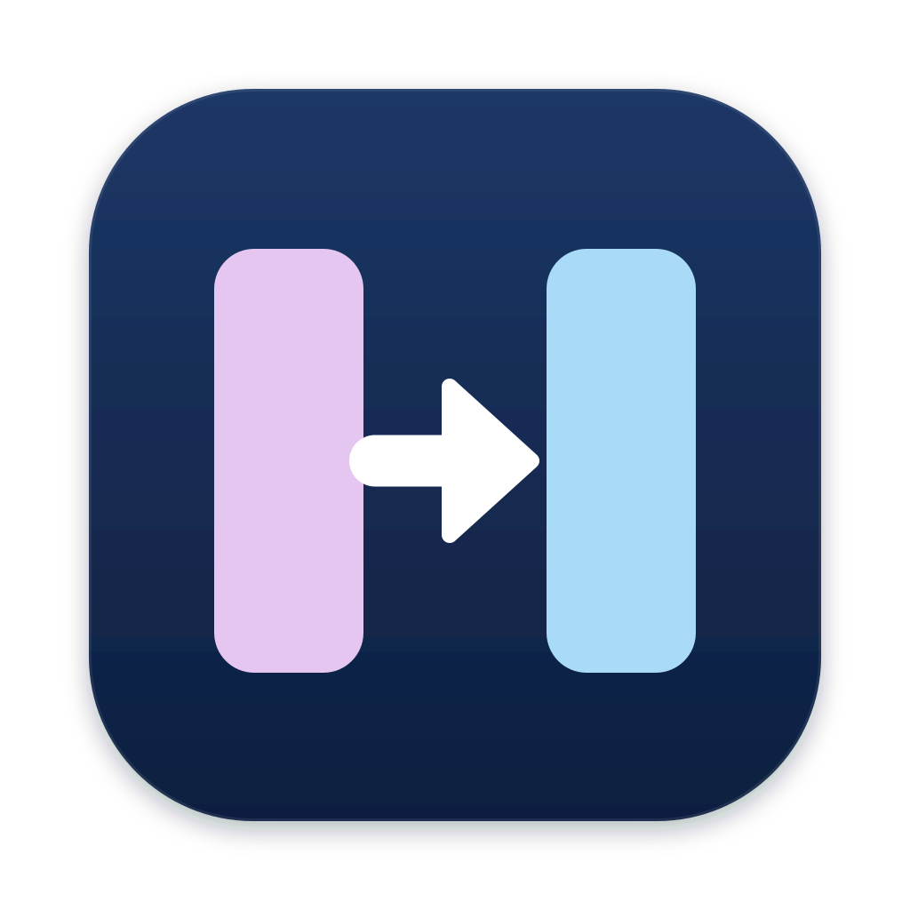
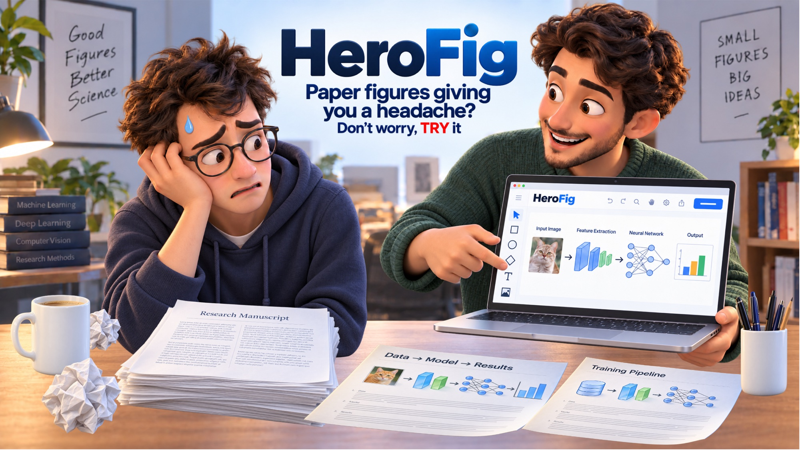
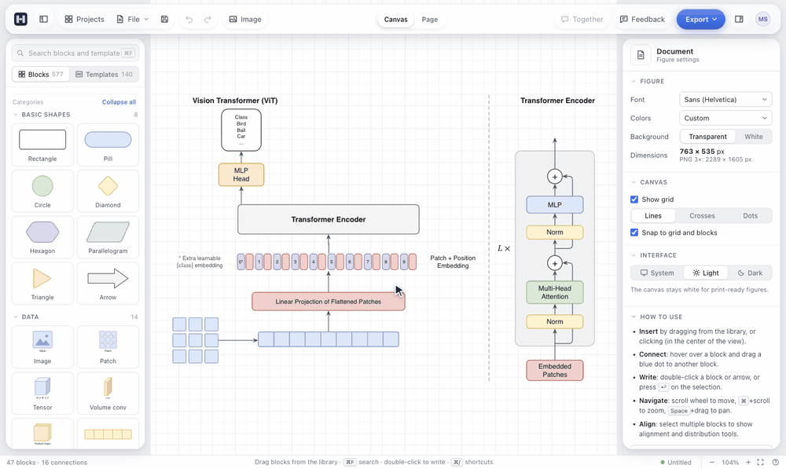
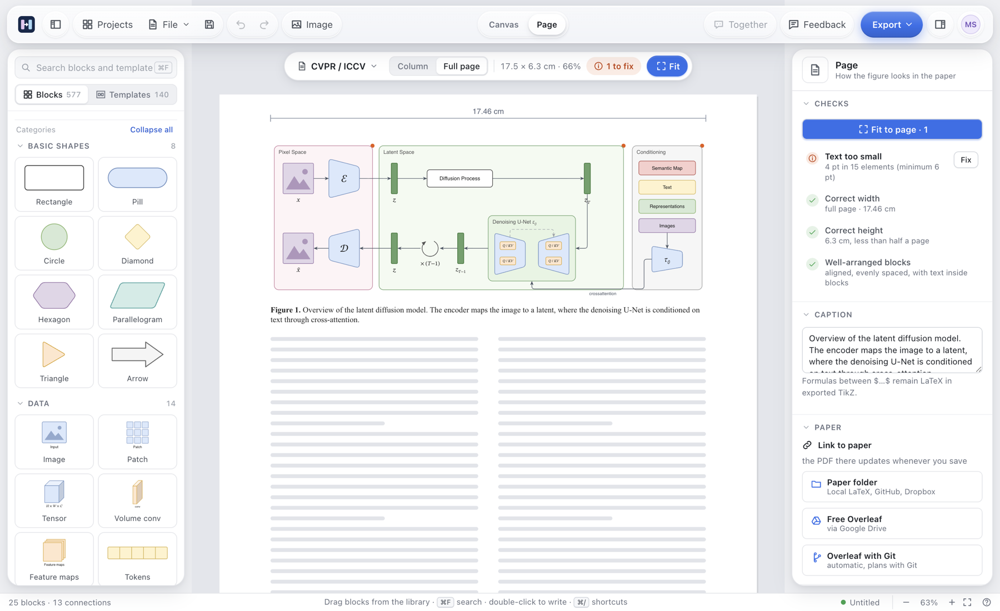

<p align="center">
  
</p>

<h1 align="center">HeroFig</h1>

<p align="center">
  Ogni paper ha bisogno di una figura eroe.<br>
  Disegnala alla misura in cui verrà stampata e mettila direttamente in LaTeX.
</p>

<p align="center">
  <a href="https://github.com/matteodisalvo/herofig/releases/latest"></a>
  <a href="https://github.com/matteodisalvo/herofig/actions/workflows/checks.yml"></a>
  
  
  
  <a href="LICENSE"></a>
</p>

<p align="center">
  <a href="#-cosa-fa">Cosa fa</a> · <a href="#-installazione">Installazione</a> ·
  <a href="#-come-si-usa">Come si usa</a> · <a href="#-privacy">Privacy</a> ·
  <a href="#-feedback">Feedback</a> · <a href="README.md">Read in English</a>
</p>

<p align="center">
  
</p>

## 🎬 Come funziona

<p align="center">
  
</p>

## ⬇️ Scarica

<p align="center">
  <a href="https://github.com/matteodisalvo/herofig/releases/latest"></a>
  <a href="https://github.com/matteodisalvo/herofig/releases/latest"></a>
</p>

Gratis e open source, senza account, e le tue figure restano sul tuo computer. La prima
volta che lo apri, segui i [passi di installazione](#-installazione) qui sotto.

## ✨ Cosa fa

Parti da un modello o trascina i blocchi dalla libreria, scrivi le etichette, e HeroFig ti mostra
la figura sulla pagina del tuo paper, alla misura in cui la vedrà chi legge. Quando è giusta,
esportala in PDF, SVG, PNG o TikZ, oppure lascia che HeroFig la scriva nella cartella del paper a
ogni salvataggio.

- **Una libreria fatta per i paper**: con i pacchetti, più di 1000 blocchi (tensori, piccole
  architetture come U-Net, CNN, RNN e FPN, grafici, icone e immagini scientifiche) e quasi 250
  figure pronte di modelli noti (Transformer, U-Net, diffusione, VQ-VAE, NeRF, SAM, Llama…) da
  cui partire.
- **Pacchetti per il tuo campo**: medicina e biomedicina, segnali, visione, reinforcement learning
  e NLP, machine learning classico, robotica, quantum computing, quantum machine learning,
  genomica, ottica e chimica. Installi solo quelli che ti servono.
- **La vedi sulla pagina**: CVPR/ICCV, ICML, IEEE, NeurIPS/ICLR e MICCAI/LNCS, a una colonna o a
  pagina intera, con la didascalia. HeroFig segnala i testi sotto i 6 pt e quelli che escono dal
  loro blocco, e **Adatta alla pagina** risistema la figura finché si legge bene.
- **Colori a prova di stampa**: temi per ruolo (pastello, sobrio, per daltonici, bianco e nero) e
  un'anteprima di come appare la figura in scala di grigi e a chi non distingue i colori.
- **Export che piace a LaTeX**: SVG, PDF, PNG alla risoluzione che scegli, e TikZ con l'ambiente
  `figure` e la didascalia già al loro posto. Copia come immagine per le slide, o come SVG per
  Figma e Inkscape.
- **Sempre aggiornata nel paper**: collega la cartella del paper e ogni salvataggio scrive il PDF e
  il TikZ accanto al tuo `.tex`; funziona anche con Overleaf, tramite Google Drive o Git.
- **Insieme**: commenti appuntati sulla figura e modifica dal vivo con il tuo gruppo sulla stessa
  rete, in stanze, grazie a un piccolo server che gira dentro una copia dell'app. I progetti
  tengono insieme le figure di un paper, con una scadenza e uno stato per ciascuna.
- **Immagini AI facoltative**: illustrazioni per i tuoi blocchi, create da un modello aperto
  tramite Hugging Face. Le immagini generate sono segnate, così ti ricordi di dichiararle nel paper.
- **Parla dodici lingue**: italiano, inglese, spagnolo, francese, tedesco, portoghese, russo,
  cinese, giapponese, coreano, arabo e hindi, in modalità chiara o scura.

## 🖼️ La vista Pagina

<p align="center">
  
</p>

## 📦 Installazione

Scarica il file per il tuo sistema dall'[ultima versione](https://github.com/matteodisalvo/herofig/releases/latest).

###  macOS

1. Scarica `HeroFig-<versione>-macOS-arm64.dmg` per i Mac con Apple silicon (M1 e successivi) o
   `HeroFig-<versione>-macOS-x64.dmg` per i Mac Intel, e aprilo.
2. Trascina **HeroFig** su **Applicazioni**.
3. La prima volta macOS può dire che non riesce a verificare lo sviluppatore, perché l'app non è
   autenticata da Apple. Apri **Impostazioni di Sistema → Privacy e sicurezza**, scorri in basso
   e fai clic su **Apri comunque**. Basta farlo una volta.

###  Windows

1. Scarica `HeroFig-<versione>-Windows-Setup.exe` e fai doppio clic.
2. Se Windows SmartScreen avvisa di un editore sconosciuto, fai clic su **Ulteriori informazioni →
   Esegui comunque**.
3. Segui l'installazione: puoi installare HeroFig solo per il tuo utente, senza permessi di
   amministratore.

### Dal codice sorgente

Su qualsiasi sistema con [Node.js](https://nodejs.org) 22 o più recente:

```bash
git clone https://github.com/matteodisalvo/herofig.git
cd herofig
npm install
npm run dev             # l'app desktop, che si ricarica mentre modifichi il codice
```

## 🚀 Come si usa

1. Parti da un modello, o trascina i blocchi dalla libreria a sinistra (⌘F / Ctrl+F per cercare).
   Doppio clic su un blocco per scriverne l'etichetta; la barra sopra la selezione allinea e
   distribuisce i blocchi.
2. Fai clic su **Pagina** e scegli la rivista o la conferenza: la figura appare sulla pagina alla
   sua misura reale. Segui i controlli a destra, oppure premi **Adatta alla pagina**.
3. **Esporta** la figura, oppure collega la cartella del paper così ogni salvataggio (⌘S / Ctrl+S)
   aggiorna il PDF e il TikZ che il tuo `.tex` include.

Tutte le scorciatoie sono a un tasto di distanza: ⌘/ su macOS, Ctrl+/ su Windows.

### Immagini AI facoltative

Generare immagini è facoltativo e HeroFig funziona benissimo senza. Per crearne una ti serve un
account gratuito su [Hugging Face](https://huggingface.co). La prima volta fai clic su
**Crea una chiave** nel pannello **Immagine**: Hugging Face si apre con il permesso giusto già
scelto. Crea la chiave, poi incollala nel pannello. HeroFig la tiene cifrata sul tuo computer, e la
trova da solo se usi già `hf auth login` o `HF_TOKEN`. Le immagini le crea FLUX.1-schnell, un
modello aperto, tramite i fornitori di inferenza di Hugging Face: la descrizione che scrivi viene
inviata a Hugging Face e al fornitore che fa girare il modello. Ogni immagine usa un po' del piccolo
credito gratuito mensile del tuo account, poi si paga a consumo.

### Lavorare con il tuo gruppo

**Insieme** funziona senza servizi cloud. Una persona del gruppo avvia il server dall'app (può
partire insieme al computer) e condivide l'invito, un codice come
`192.168.1.20:47800/ABCD-EFGH-JKLM`. I colleghi lo incollano una volta; da lì in poi tutti possono
aprire stanze, modificare la stessa figura dal vivo e lasciarci commenti. Funziona fra computer che
si vedono: la stessa rete, o la stessa VPN.

## 🔒 Privacy

HeroFig non ha account né telemetria, e le figure sono semplici file `.hfig` sul tuo disco. Va
online solo quando glielo chiedi: quando invii un messaggio da **Feedback** (consegnato tramite
[FormSubmit](https://formsubmit.co)), quando generi un'immagine (la descrizione va a Hugging Face e
al fornitore che fa girare il modello), quando invia a Overleaf tramite Git, e per parlare con il
server del tuo gruppo sulla rete locale.

## 💡 Com'è nato

HeroFig è nato per aiutare i ricercatori a non ridisegnare ogni volta a mano gli stessi blocchi.
In ogni paper tornano un encoder, un modulo di attenzione, una U-Net, e ogni volta si riparte da
zero, per poi scoprire dopo la compilazione che i testi sono troppo piccoli. Con HeroFig quei
blocchi sono già pronti nella libreria, la figura si vede subito alla misura giusta per il paper,
e il tempo risparmiato resta per la ricerca.

## 💬 Feedback

Hai trovato un errore, ti manca un blocco o vorresti un pacchetto per il tuo campo? Scrivimi con
il pulsante **Feedback** in alto nell'app: non serve un account e ti rispondo per email. Se
preferisci, puoi anche aprire una [issue su GitHub](https://github.com/matteodisalvo/herofig/issues).

<table align="center">
  <tr>
    <td align="center">
      Se hai trovato interessante il progetto, sostienilo con una stella su GitHub.<br><br>
      <a href="https://github.com/matteodisalvo/herofig"></a>
    </td>
  </tr>
</table>

## 🛠️ Sviluppo

```bash
npm install
npm run dev          # app desktop con ricaricamento automatico
npm run dev:web      # lo stesso editor nel browser (senza le funzioni solo desktop)
npm run typecheck    # TypeScript
npm run check        # i controlli: libreria, traduzioni, configurazione, profilo, segnalazioni
```

```
herofig/
├── src/
│   ├── App.tsx, store.ts       # l'app e il suo stato
│   ├── model.ts, actions.ts    # la figura: blocchi, connessioni, azioni di modifica, formato del file
│   ├── geometry.ts, icons.ts   # forme come primitive di disegno, identiche a schermo e in ogni export
│   ├── domains/                # la libreria: un modulo di forme e modelli per ogni campo
│   ├── paper.ts, fit.ts        # la vista Pagina: riviste, misura di stampa, adatta alla pagina
│   ├── review.ts               # i controlli mostrati accanto alla pagina
│   ├── export/                 # export SVG e TikZ
│   ├── live.ts, merge.ts       # lavorare insieme: stanze dal vivo e unione delle modifiche
│   ├── locales/                # tutti i testi, in dodici lingue
│   └── components/             # l'interfaccia React
├── electron/                   # la parte desktop: finestre, menu, file, PDF, server del gruppo, immagini AI
├── scripts/                    # script di sviluppo, pacchetti e controlli
├── build/                      # icone dell'app
└── .github/workflows/          # controlli a ogni push, app a ogni versione
```

Per aggiungere forme e modelli di un nuovo campo, vedi [`src/domains/README.md`](src/domains/README.md).

### Creare le app

```bash
npm run dist         # HeroFig.app per questo Mac, in release/, per provarla al volo
npm run dist:mac     # le due immagini disco, Apple silicon e Intel
npm run dist:win     # l'installer per Windows (si può creare anche da Mac)
```

### Pubblicare una versione

Le app da scaricare non stanno nel repository: le crea GitHub e le allega a una versione, nella
pagina **Releases** del repository. Per pubblicare una nuova versione:

1. Scrivi il nuovo numero di versione in `package.json` (l'app e i nomi dei file lo prendono da lì)
   e annota cosa è cambiato in `CHANGELOG.md`.
2. Fai il commit, poi invia un tag con lo stesso numero preceduto da `v`:

```bash
git tag v<versione>
git push origin v<versione>
```

GitHub crea le app per macOS e Windows e pubblica la versione con i file allegati. Dalla scheda
**Actions** puoi anche avviare a mano il flusso **Release**: crea le app come prova, senza
pubblicare niente.

## 🌍 Traduzioni

I testi stanno in [`src/locales/`](src/locales), ognuno con le sue dodici lingue affiancate;
`npm run check` segnala ogni testo o segnaposto mancante. Le correzioni da madrelingua sono
benvenutissime.

## 🙏 Ringraziamenti

- Costruito con [Electron](https://www.electronjs.org), [React](https://react.dev),
  [Vite](https://vite.dev) e [TypeScript](https://www.typescriptlang.org).
- Immagini AI di [FLUX.1-schnell](https://huggingface.co/black-forest-labs/FLUX.1-schnell) tramite
  [Hugging Face Inference Providers](https://huggingface.co/docs/inference-providers), con il client
  [huggingface.js](https://github.com/huggingface/huggingface.js).
- Le icone sono disegnate a mano in [`src/components/Icon.tsx`](src/components/Icon.tsx).

## 📄 Licenza

[MIT](LICENSE) © 2026 Matteo Di Salvo

Fatto da **Matteo Di Salvo**: [GitHub](https://github.com/matteodisalvo) ·
[sito](https://matteodisalvo.github.io/)

## ☕ Offrimi un caffè

Se HeroFig ti ha risparmiato una notte insonne prima di una scadenza e vuoi dire grazie, puoi
offrirmi un caffè:

<p align="center">
  <a href="https://buymeacoffee.com/matteodisalvo"></a>
</p>
